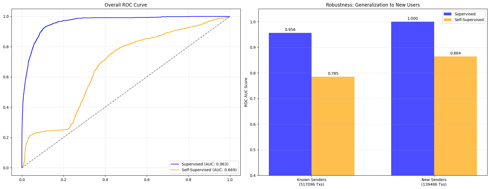
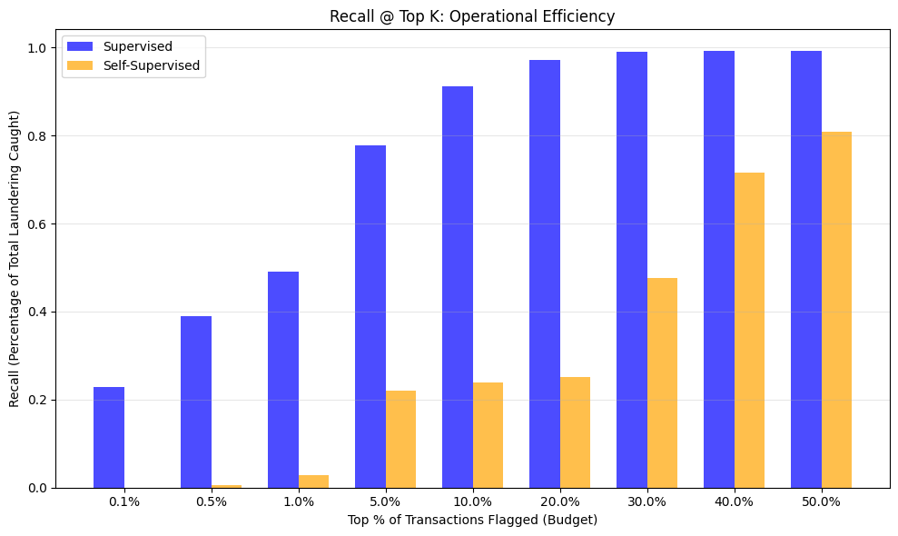
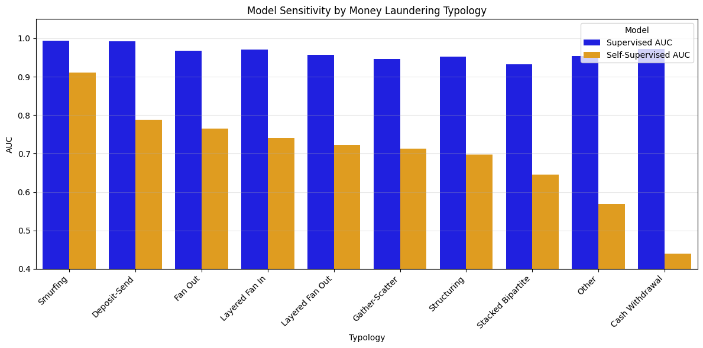
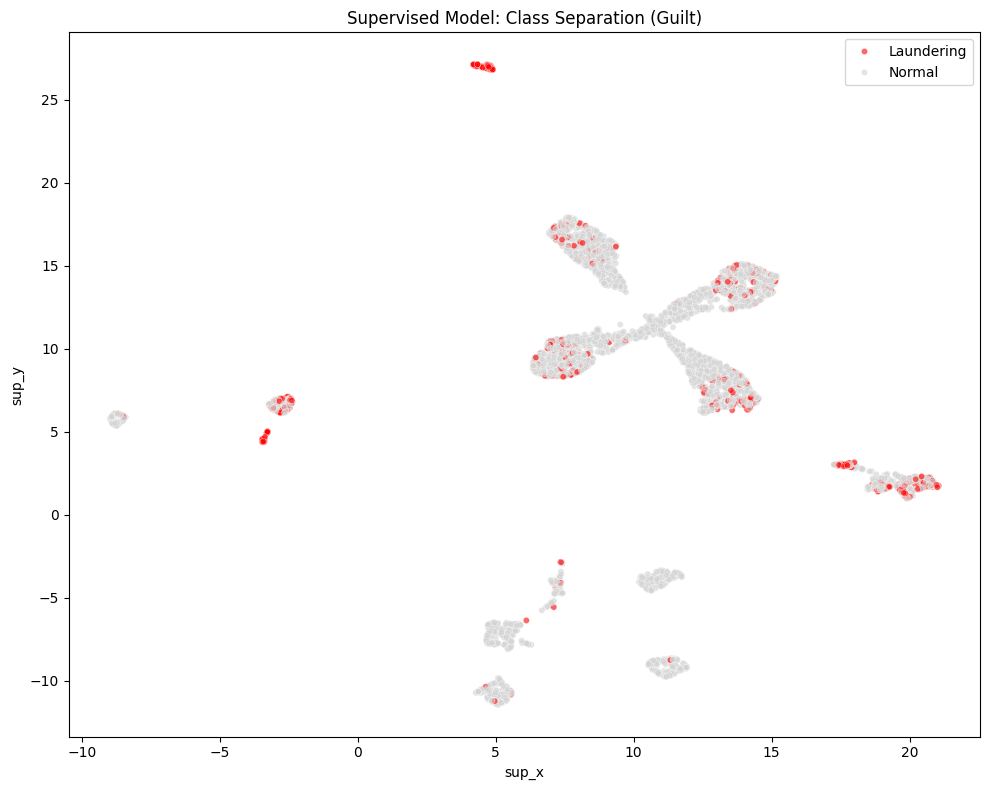
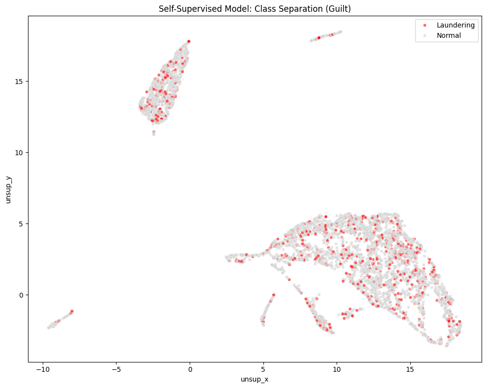

# Self-Supervised Link Prediction vs. Supervised Classification in Graph Neural Networks for Anti-Money Laundering

**Author:** Sandro Khizanishvili  
**Course:** Signal Processing for Machine Learning  
**Institution:** Sapienza University of Rome  
**Date:** February 2026

---

## 1. Executive Summary

Anti-Money Laundering (AML) constitutes one of the most consequential challenges in computational finance. Global money laundering is estimated to account for 2–5% of worldwide GDP (€1.7T–€4T annually), yet current rule-based Transaction Monitoring Systems (TMS) are plagued by false positive rates exceeding 95%, burying genuine threats in noise [1, 3]. The scarcity, delay, and cost of obtaining reliable ground-truth labels further compound the difficulty of applying standard supervised learning paradigms to this domain.

This project addresses the AML challenge by leveraging the relational structure inherent in financial data. We model the transactional ecosystem as a directed bipartite graph $G = (C \cup T, E)$ linking Customers ($C$) and Transactions ($T$), and develop two distinct Graph Neural Network (GNN) architectures upon it:

1. A **Self-Supervised Link Prediction model** (inspired by LaundroGraph [1]), which learns to reconstruct the graph's structural patterns without access to labels, flagging anomalies as deviations from learned normalcy.
2. A **Supervised Edge Classification model**, which is explicitly trained to classify each transaction edge as *Laundering* or *Normal* using ground-truth labels and a heavily weighted loss function.

Both models are evaluated on the SAML-D (Synthetic Anti-Money Laundering Dataset) [2], which contains 28 distinct behavioral typologies and a realistic laundering rate of just **0.1%**. The central finding is that the **Supervised Edge Classification model offers dramatically superior operational efficiency** for front-line detection—achieving a **0.963 ROC AUC**, capturing approximately **78% of all laundering within the top 5% of flagged transactions**, and producing near-perfect class separation in the learned embedding space. The Self-Supervised model, while less precise, demonstrates unique value as a complementary discovery tool for detecting structurally anomalous typologies (e.g., Smurfing) without any dependence on historical labels.

---

## 2. Dataset & Graph Construction

### 2.1. The SAML-D Dataset

The project utilizes the SAML-D (Synthetic Anti-Money Laundering Dataset) [2], an expansive benchmark specifically designed to mirror the complexity of real-world financial crime. Key characteristics include:

- **Composition:** ~855K unique Customer accounts and ~9.5M Transaction records.
- **Typological Diversity:** 28 distinct behavioral patterns are encoded in the dataset, of which 17 represent suspicious laundering typologies (e.g., Smurfing, Fan-In/Fan-Out, Stacked Bipartite, Cash Withdrawal) and 11 represent normal transaction behaviors (e.g., Payroll, Cross-Border Trade).
- **Class Imbalance:** The target laundering rate is just **0.1%**, reflecting the needle-in-a-haystack challenge faced by real-world compliance teams.

### 2.2. Temporal Splitting Strategy

To prevent data leakage and faithfully simulate a continuous monitoring environment, the dataset timeline (October 2022 – August 2023) was partitioned into three strict, non-overlapping temporal windows:

| Window | Period | Purpose | Size |
|---|---|---|---|
| **Profile** | 2022/10 – 2023/02 | Historical customer behavior profiling; feature generation only. | ~3.9M Txns |
| **Training** | 2023/03 – 2023/07 | Active model learning (graph construction, message passing, supervision). | ~4.5M Txns |
| **Testing** | 2023/08 | Out-of-time evaluation on entirely unseen future transactions. | ~0.7M Txns |

This temporal discipline ensures that all features computed during the Profile Window are strictly historical relative to the Training Window, and that the Testing Window represents genuinely future, unseen data.

### 2.3. Graph Design: Directed Heterogeneous Bipartite Graph

The financial ecosystem was modeled as a directed, heterogeneous bipartite graph $G = (C \cup T, E)$ with two node types and two directed edge types:

- **Node Types:** `customer` (accounts) and `transaction` (financial events).
- **Edge Types:** `customer` $\xrightarrow{\text{sends}}$ `transaction` and `transaction` $\xrightarrow{\text{receives}}$ `customer`, capturing the directional flow of funds.

**Graph Statistics:**

| Metric | Value |
|---|---|
| Total Customer Nodes | ~0.7M |
| Total Transaction Nodes | ~5.2M |
| Graph Ratio | 1 Customer ≈ 8 Transactions |
| Training Edges (total) | ~4.5M |
| — Message Passing (MP) edges | ~2.3M (50%) |
| — Supervision edges | ~1.4M (30%) |
| — Validation edges | ~0.9M (20%) |
| Test Edges | ~0.7M |

The 50/30/20 split of training edges is architecturally critical. **Message Passing (MP) edges** provide the structural scaffold during GNN computation—they are used exclusively for neighborhood aggregation and are never directly supervised. **Supervision edges** are the edges on which the loss function is computed and gradients flow. **Validation edges** are used for hyperparameter tuning and early stopping. This separation prevents the model from trivially memorizing the graph structure it uses for message passing.

---

## 3. Feature Engineering

A central contribution of this work is the extensive, domain-informed feature engineering pipeline implemented in `Data_Preparation.ipynb`. Raw SAML-D records were transformed into dense, semantically rich node feature vectors.

### 3.1. Customer Node Features (123 Dimensions)

Customer features were derived from the **Profile Window** using a rolling-window aggregation strategy. For each customer, behavioral statistics were computed across five temporal granularities: **1-Day, 7-Day, 1-Month, 3-Month, and Full History** (relative to the Profile Window boundary). This multi-scale approach captures both recent behavioral shifts and long-term baseline patterns.

For each window, the following feature families were extracted:

**Behavioral Aggregates (per window):**
- **Volume Statistics:** `Total_Sent`, `Total_Received`, `Count_Sent`, `Count_Received`, `Max_Sent`, `Min_Sent`, `Avg_Sent`, `Avg_Received`.
- **Volatility:** Standard deviation of sent amounts (`Volatility_Sent`), capturing erratic transaction behavior.
- **In/Out Balance:** `Sent_Received_Ratio = Total_Sent / (Total_Received + ε)`, a key indicator of pass-through accounts (ratio ≈ 1.0 is suspicious for layering).
- **Fan-Out/Fan-In:** `Unique_Recipients` and `Unique_Senders`, measuring the breadth of an account's network.

**Anomaly Indicators (per window):**
- **Structuring Detection:** Count of transactions with amounts in the $[9{,}000, 10{,}000)$ range, a classic indicator of deliberate threshold avoidance.
- **Cash Dependency:** `Cash_Volume` and `Cash_Ratio`, computed by filtering for `Payment_type ∈ {Cash Deposit, Cash Withdrawal}`. Empirical analysis revealed that cash-involved transactions exhibit a ~6.5× higher laundering rate than non-cash transactions.
- **Cross-Border Exposure:** `Cross_Border_Count_Sent`, `Cross_Border_Count_Rec`—counts of transactions where `Sender_bank_location ≠ Receiver_bank_location`.
- **High-Risk Jurisdiction Density:** `High_Risk_Count`—interactions involving jurisdictions flagged as high-risk (`Mexico, Turkey, Morocco, UAE`). Analysis showed a ~5.7× elevated laundering rate for transactions involving these jurisdictions.

**Temporal Latency Features:**
These features capture the *speed* of fund movement, which is a hallmark of money laundering:
- `Avg_Time_Cash_To_Send`: Average hours between receiving a Cash Deposit and initiating an outbound transfer. Rapid turnaround indicates potential placement-layering behavior.
- `Avg_Time_Wire_To_Wire`: Average hours between receiving an ACH/Cross-border wire and sending a cross-border wire. Short latencies signal automated layering.
- `Rapid_Movement_Count`: Count of In→Out event pairs occurring within < 1 hour.

Accounts with no observed pattern for a given latency feature were assigned a sentinel value of 9999 (indicating "no such suspicious pattern found"), effectively encoding the *absence* of suspicious behavior as a low-risk signal.

**Cold Start Handling:** Customers appearing only in the Training/Testing windows but absent from the Profile Window receive all-zero feature vectors, relying on the model's residual connections (Section 4.1) for meaningful embeddings.

**Normalization:** All 123 customer features were normalized using `StandardScaler` (Z-score normalization), fit exclusively on the training portion to prevent data leakage.

### 3.2. Transaction Node Features (49 Dimensions)

Each transaction edge was independently featurized:

- **Amount:** Log-transformed (`np.log1p(Amount)`) to compress the heavy-tailed distribution, then standardized.
- **Cyclical Temporal Encoding:** The hour of the day was encoded as $(\sin(2\pi h / 24), \cos(2\pi h / 24))$ to preserve the circular continuity between 23:00 and 00:00. The day of the week was encoded as an integer and standardized.
- **Interaction Flags:** Binary indicators for `Is_Cross_Border` (sender and receiver in different locations) and `Is_Currency_Mismatch` (payment currency ≠ received currency).
- **Categorical One-Hot Encoding:** `Payment_type`, `Sender_bank_location`, and `Receiver_bank_location` were one-hot encoded. The encoding was fit on the union of Train + Test data to ensure column alignment, but the scaler was fit only on the training data.

---

## 4. Model Architecture

Both models share an identical GAT-based encoder but diverge in their decoder design and training objective, reflecting fundamentally different learning paradigms.

### 4.1. Shared GAT-Based Encoder

The encoder's role is to project each node into a shared $d=64$ dimensional latent space, producing embeddings $z_c \in \mathbb{R}^{64}$ for customers and $z_t \in \mathbb{R}^{64}$ for transactions.

**Step A — Dimensionality Alignment via Linear Projection:**
The heterogeneous nature of the graph introduces a dimensionality mismatch: customer nodes have 123 input features while transaction nodes have 49. Before any graph convolution can occur, both node types must be mapped into a common representational space. This is achieved through dedicated linear projection layers:

```python
# Map heterogeneous dimensions → shared 64-dim space
self.cust_lin = Linear(-1, hidden_channels)   # 123 → 64
self.tx_lin   = Linear(-1, hidden_channels)   #  49 → 64
```

The projected outputs $x_c^{\text{proj}}, x_t^{\text{proj}} \in \mathbb{R}^{64}$ represent the node's *intrinsic features* independent of any graph structure. This projection is critical: it provides the "self-loop" content for the subsequent residual connection.

**Step B — Graph Attention Convolution (2-Layer GAT):**
The projected features are passed through two heterogeneous GAT layers wrapped in `HeteroConv`, which independently parameterizes message passing for each edge type (`sends`, `receives`):

- **Layer 1 (Expansion):** `GATConv(64, 64, heads=2, add_self_loops=False)` — Applies multi-head attention (2 heads) and *concatenates* the head outputs, expanding the representation to $64 \times 2 = 128$ dimensions. The `add_self_loops=False` flag is mandatory for bipartite graphs where source and target node types differ.
- **Layer 2 (Compression):** `GATConv(128, 64, heads=2, add_self_loops=False, concat=False)` — Applies 2-head attention but *averages* the heads (via `concat=False`), compressing back to 64 dimensions.

The attention mechanism learns *which neighbors* are most informative for each node, enabling the model to selectively attend to high-signal connections while dampening noise.

**Step C — Residual Connection (Cold Start Safety Net):**
The GNN output $x^{\text{GNN}}$ captures purely *structural/neighborhood* information. For well-connected nodes, this is rich and informative. However, for cold-start nodes (new customers with zero historical edges), the GNN output is a zero vector—catastrophic for downstream prediction.

The solution is a manual residual connection that additively combines the GNN output with the original linear projection:

$$z_c = x_c^{\text{GNN}} + x_c^{\text{proj}}$$
$$z_t = x_t^{\text{GNN}} + x_t^{\text{proj}}$$

```python
# Residual: structure (GNN) + intrinsic features (projection)
z_cust = x_gnn2['customer'] + x_cust_proj
z_tx   = x_gnn2['transaction'] + x_tx_proj
```

This guarantees that even a completely isolated node retains a meaningful embedding derived from its intrinsic features. The Supervised model additionally wraps this sum in `LayerNorm` for training stability — see Section 4.3.

**What the Embeddings Capture:**
The resulting $z_c$ and $z_t$ vectors encode a fusion of:
1. **Intrinsic Properties:** The node's own feature profile (from the linear projection).
2. **Local Neighborhood Context:** Attention-weighted aggregations from 1-hop and 2-hop neighbors (from the GAT layers).
3. **Structural Role:** Implicit encoding of a node's position and connectivity pattern within the graph.

### 4.2. Self-Supervised Link Prediction Model (LaundroGraph Baseline)

This model, inspired by Cardoso et al. [1], treats AML detection as an unsupervised anomaly detection problem: the model learns to *reconstruct* the graph, and edges it fails to predict are flagged as anomalies.

**Decoder — Hadamard Product:**
The interaction between a customer $c$ and transaction $t$ is scored via element-wise multiplication (Hadamard product) followed by an MLP:

$$z_e = z_c \odot z_t \in \mathbb{R}^{64}$$
$$\text{score}_{c,t} = \text{MLP}(z_e) \quad \text{where MLP}: 64 \rightarrow 32 \rightarrow 1$$

```python
# Hadamard product: element-wise multiplication
combined = z_c_batch * z_t_batch
return self.decoder(combined).view(-1)
```

The Hadamard product measures *per-dimension compatibility* between the customer and transaction embeddings. It answers: "Does this customer's profile, dimension by dimension, align with this transaction's characteristics?"

**Training Objective:** Standard Binary Cross-Entropy (BCE) loss over observed edges ($e^+$, label=1) and randomly sampled negative edges ($e^-$, label=0) with a 1:1 negative sampling ratio.

**Anomaly Scoring at Inference:**
During testing, the model scores each real test edge. The anomaly score is defined as:

$$\text{AnomalyScore}_{c,t} = 1 - P(\text{link} \mid z_c, z_t)$$

A high anomaly score indicates that the model finds the observed connection *structurally surprising*—the customer's embedding and the transaction's embedding are incompatible given the patterns learned from the training graph.

**Bidirectional Severing Protocol:**
A critical implementation detail for fair evaluation: during test-time inference, the test edges themselves must be *severed* from the graph used for embedding computation (to prevent information leakage). The implementation uses a bidirectional severing strategy, computing separate embeddings with the sender-side and receiver-side test edges removed, then combining the scores.

**Strengths:**
- Requires zero labels, making it viable in label-scarce environments.
- Excels at detecting crimes with *unnatural graph shapes* (e.g., Smurfing creates high-degree "star" patterns, achieving ~91% AUC on this typology).

**Limitations:**
- Fails on **"Structural Mimicry"**: when criminal flows intentionally replicate legitimate patterns (e.g., Stacked Bipartite mimicking payroll), the model cannot distinguish "good" from "bad" twins.
- Fails on **structurally simple crimes**: Cash Withdrawal creates a single edge, which is topologically identical to a legitimate purchase (~44% AUC, below random chance).
- Generates high false positive rates, as it flags *all* structural anomalies regardless of criminal intent.

### 4.3. Supervised Edge Classification Model (Primary Engine)

This model is the primary contribution of this project. Unlike the self-supervised baseline, it is explicitly trained to classify each edge as Laundering or Normal, using ground-truth labels and a class-imbalance-aware objective.

**Decoder — Concatenation + MLP:**
Instead of element-wise multiplication, the supervised decoder *concatenates* the customer and transaction embeddings, preserving their full individual information:

$$z_e = z_c \| z_t \in \mathbb{R}^{128}$$
$$P(\text{launder} \mid c, t) = \sigma(\text{MLP}(z_e)) \quad \text{where MLP}: 128 \rightarrow 64 \rightarrow 1$$

```python
class LaundroGraphSupervised(torch.nn.Module):
    # ... (encoder identical to Section 4.1) ...
    
    # Decoder: Concatenation-based classification
    self.decoder = torch.nn.Sequential(
        torch.nn.Linear(out_channels * 2, out_channels),  # 128 → 64
        torch.nn.ReLU(),
        torch.nn.Dropout(0.2),
        torch.nn.Linear(out_channels, 1)                  # 64 → 1
    )
    
    def forward_decoder(self, z_c, z_t, edge_label_index):
        z_c_batch = z_c[edge_label_index[0]]
        z_t_batch = z_t[edge_label_index[1]]
        combined = torch.cat([z_c_batch, z_t_batch], dim=1)  # Concatenation
        return self.decoder(combined).view(-1)
```

**Why Concatenation over Hadamard Product?**
The Hadamard product is a *symmetric, restrictive* interaction function—it can only capture per-dimension correlations. Concatenation, followed by an MLP, provides a *strictly more expressive* function class: the MLP can learn arbitrary non-linear interactions between any combination of dimensions from $z_c$ and $z_t$. This expressiveness is essential for the classification task, where the model must learn to discriminate subtle patterns that distinguish laundering from legitimate transactions.

**Training Objective — Weighted Binary Cross-Entropy:**
The extreme class imbalance (0.1% positive rate) renders standard BCE ineffective—the model could achieve 99.9% accuracy by predicting all-negative. To counteract this, we apply a massive positive class weight:

$$w_{\text{pos}} = \frac{N_{\text{negative}}}{N_{\text{positive}}} \approx 939.8$$

```python
pos_weight = torch.tensor([num_neg / max(num_pos, 1)])  # ≈ 939.8
criterion = torch.nn.BCEWithLogitsLoss(pos_weight=pos_weight)
```

This weight tells the loss function: *"Missing one laundering transaction is as costly as misclassifying 940 normal ones."* The weight is computed solely from the Supervision edge subset to prevent data leakage.

**Key difference from Self-Supervised training:** Negative sampling is **disabled** (`neg_sampling_ratio=0.0`). The model trains exclusively on real edges with their true labels, not on artificially constructed negative edges.

**Training Hyperparameters:**

| Parameter | Self-Supervised | Supervised |
|---|---|---|
| Hidden Channels | 64 | 64 |
| Output Channels | 64 | 64 |
| GAT Heads | 2 | 2 |
| Neighbor Sampling | [20, 10] | [20, 10] |
| Batch Size | 2048 | 1024 |
| Learning Rate | 0.001 | 0.001 |
| Optimizer | Adam | Adam |
| Loss Function | BCE | Weighted BCE ($w=939.8$) |
| Negative Sampling | 1:1 ratio | Disabled |
| Regularization | — | Dropout(0.2) |
| Normalization | Residual only | Residual + LayerNorm |
| Epochs | 20 | 5 |

**Strengths:**
- Perfect class separation in the learned embedding space.
- Exceptionally high recall at low alert budgets (~78% recall in top 5%).
- Robust generalization to cold-start customers via residual connections.

**Limitations:**
- Entirely dependent on the quality and completeness of historical labels.
- Cannot detect novel typologies absent from the training distribution.
- Potentially vulnerable to adversarial adaptation by sophisticated launderers who evolve their behavior.

---

## 5. Evaluation & Results

All results are reported on the **out-of-time Test Window (August 2023)**, comprising ~0.7M transactions never seen during training.

### 5.1. Overall Discriminative Performance

| Metric | Supervised | Self-Supervised |
|---|---|---|
| **ROC AUC** | **0.963** | 0.669* |
| **Avg. Precision (AP)** | 0.144 | 0.006 |
| **MCC (@ optimal threshold)** | 0.261 | — |

*\*Self-supervised AUC varies significantly by typology (see Section 5.3).*

The supervised model achieves a **0.963 ROC AUC**, demonstrating near-perfect discriminatory power. The self-supervised model achieves a respectable but substantially lower global AUC, as its structural anomaly scores correlate only partially with actual laundering labels.



### 5.2. Operational Efficiency — Recall @ Top K

In a real-world AML pipeline, compliance teams operate under a fixed **alert budget**: they can only review the top-K most suspicious transactions. Recall@K measures what fraction of total laundering is captured within that budget.

| Alert Budget (Top K%) | Alerts Generated | Supervised Recall | Self-Supervised Recall |
|---|---|---|---|
| 0.1% | ~656 | 23% | 0% |
| 0.5% | ~3,282 | 39% | 1% |
| 1% | ~6,565 | 49% | 3% |
| **5%** | **~32,829** | **~78%** | 22% |
| 10% | ~65,658 | 91% | 24% |
| 30% | ~196,974 | ~100% | ~48% |

**Key Insight:** The Supervised model captures **approximately 78% of all laundering transactions by reviewing just the top 5% of alerts**. The Self-Supervised model requires reviewing the **top 50%** to achieve comparable recall—an operationally impractical budget. The Self-Supervised model's top-K is polluted with "weird but legal" transactions (structural anomalies that are not criminal).



### 5.3. Typology-Specific Sensitivity

The models exhibit dramatically different detection sensitivities across laundering typologies, revealing the fundamental trade-off between structural anomaly detection and label-driven classification:

| Typology | Count | Supervised AUC | Self-Supervised AUC | Winner |
|---|---|---|---|---|
| Smurfing | 81 | ~0.99 | **~0.91** | Sup (but Self-Sup is strong) |
| Deposit-Send | 68 | ~0.99 | ~0.79 | Supervised |
| Fan Out | 46 | ~0.97 | ~0.77 | Supervised |
| Layered Fan-In | 47 | ~0.97 | ~0.74 | Supervised |
| Layered Fan Out | 46 | ~0.96 | ~0.72 | Supervised |
| Gather-Scatter | 41 | ~0.95 | ~0.71 | Supervised |
| Structuring | 173 | ~0.95 | ~0.70 | Supervised |
| Stacked Bipartite | 84 | ~0.93 | ~0.65 | Supervised |
| Other (grouped <40) | 105 | ~0.95 | ~0.57 | Supervised |
| Cash Withdrawal | 139 | ~0.97 | **~0.44** | Supervised |

**Critical Observations:**
- The **Supervised model achieves uniformly high AUC (0.93–0.99) across all typologies**, demonstrating that label-driven learning generalizes well within the SAML-D distribution.
- The **Self-Supervised model exhibits massive variance** (0.44–0.91 AUC), with performance directly correlated to the *structural distinctiveness* of the typology:
  - **Smurfing (~0.91 AUC):** Creates characteristic "star" topologies (many small transactions from many accounts converging on one), which are highly anomalous structurally.
  - **Cash Withdrawal (~0.44 AUC, below random chance):** Generates a single edge—topologically indistinguishable from a legitimate purchase. The self-supervised model has no structural signal to exploit.
  - **Stacked Bipartite (~0.65 AUC):** Mimics legitimate payroll patterns, exposing the **Structural Mimicry Barrier**—the fundamental limitation of self-supervised approaches.



### 5.4. Embedding Space Visualization (UMAP)

Stratified UMAP projections of the learned 64-dimensional transaction embeddings reveal the geometric consequences of each training paradigm:

**Supervised Model:**
- **Result:** Near-perfect separation. Laundering transactions (red) are pushed into a distinct, isolated cluster, far from the Normal (grey) mass.
- **Interpretation:** The model has learned an explicit representation of "guilt"—the MLP decoder has reshaped the embedding space to maximize the margin between classes.



**Self-Supervised Model:**
- **Result:** Significant overlap. Laundering transactions are scattered *within* the Normal clusters.
- **Interpretation:** The model groups transactions by *structural similarity*, not by *criminal intent*. A money laundering transaction that structurally resembles a payroll will be embedded near payroll transactions, regardless of its illicit nature.



### 5.5. Model Overlap Analysis

To quantify the complementarity of the two models, we analyzed the overlap in their top-1% alert sets:

- **Intersection (flagged by BOTH):** The highest-precision subset—transactions that are both structurally anomalous *and* label-predicted as laundering.
- **Supervised-Only detections:** Pattern-matched crimes that look structurally normal but were flagged by label-driven classification (e.g., structurally mimetic typologies).
- **Self-Supervised-Only detections:** Structurally anomalous transactions that the supervised model missed—potential novel typologies or adversarial behaviors not represented in the training labels.

| Alert Subset (Top 1% = 6,565 alerts) | Alerts | Launderers Found | Precision |
|---|---|---|---|
| Intersection (Both models) | 248 | 20 | 8.1% |
| Supervised Only | 6,317 | 388 | 6.1% |
| Self-Supervised Only | 6,317 | 4 | 0.1% |

The intersection is the highest-confidence tier: transactions flagged by both systems carry an 8.1% precision—more than 80× above the base rate. The Supervised model's unique detections (6.1% precision) vastly outnumber the Self-Supervised model's unique detections (0.1% precision), confirming its role as the primary engine. The Self-Supervised-Only detections, while few in number, represent structurally anomalous activity that the supervised model has not learned to recognize.

---

## 6. Operational Impact & Deployment Strategy

The complementary strengths and weaknesses of the two models naturally suggest a **dual-tiered AML pipeline**:

### Tier 1: Primary Alert Generation (Supervised Model)
The Supervised Edge Classification model serves as the front-line, high-throughput engine. With a 0.963 AUC and the ability to capture ~78% of laundering within a 5% alert budget, it delivers:
- **Massive reduction in false positive alert fatigue** compared to rule-based systems.
- **Automated blocking** of known laundering typologies with high confidence.
- **Scalable real-time scoring** via the optimized batched inference pipeline.

### Tier 2: Discovery & Safety Net (Self-Supervised Model)
The Self-Supervised model operates periodically as a discovery mechanism:
- **Novel Typology Detection:** By flagging structural anomalies regardless of historical labels, it can identify emerging laundering patterns that the supervised model has never been trained on.
- **Adversarial Robustness:** Accounts that pass the supervised check but exhibit structurally anomalous behavior (high anomaly score, low supervised probability) warrant deeper investigation.
- **Label Generation:** The self-supervised model's detections can be reviewed by analysts, generating new labeled data to retrain and expand the supervised model's coverage.

### The Fundamental Trade-off

| Dimension | Supervised | Self-Supervised |
|---|---|---|
| **What it detects** | Known patterns from labels | Structural anomalies |
| **Precision** | High (low false positives) | Low (flags all anomalies) |
| **Recall @ 5%** | ~78% | Low |
| **Novel typology detection** | ✗ Cannot find unknowns | ✓ Designed for unknowns |
| **Structural mimicry** | ✓ Handles via labels | ✗ Fails (mimicry barrier) |
| **Label dependency** | ✓ Requires labels | ✗ Label-free |
| **Deployment role** | Front-line blocking | Periodic discovery |

---

## 7. Conclusions

This project demonstrates that the choice between self-supervised and supervised GNN architectures for AML is not binary but complementary. The **Supervised Edge Classification model** is the unambiguous winner for primary detection: its concatenation-based decoder, combined with aggressively weighted BCE loss, achieves near-perfect discrimination (0.963 AUC) and operationally viable recall at practical alert budgets. The **Self-Supervised Link Prediction model** retains essential value as a discovery tool, particularly for typologies with distinctive structural signatures.

The key architectural insight is that **geometry drives self-supervised detection**: the model excels when criminal behavior creates unnatural graph shapes (Smurfing ≈ star patterns) but fails when crime mimics legitimate structure (Cash Withdrawal ≈ single edge, Stacked Bipartite ≈ payroll). Supervised learning transcends this limitation by directly encoding the concept of "guilt" into the embedding space.

Future work should explore:
- **Hybrid loss functions** combining structural reconstruction with label-driven classification.
- **Continual learning** strategies that allow the supervised model to adapt to emerging typologies.
- **Adversarial robustness** testing against sophisticated launderers who intentionally adapt their behavior.

---

## 8. References

1. Cardoso, M., Saleiro, P., & Bizarro, P. (2022). *"LaundroGraph: Self-Supervised Graph Representation Learning for Anti-Money Laundering."* arXiv:2210.14360.

2. Oztas, B., Cetinkaya, D., Adedoyin, F., Budka, M., & Dogan, H. (2023). *"Enhancing Anti-Money Laundering: Development of a Synthetic Transaction Monitoring Dataset."* Bournemouth University.

3. Cheng, D., Zou, Y., Xiang, S., & Jiang, C. (2024). *"Graph Neural Networks for Financial Fraud Detection: A Review."* Frontiers of Computer Science. arXiv:2411.05815.
